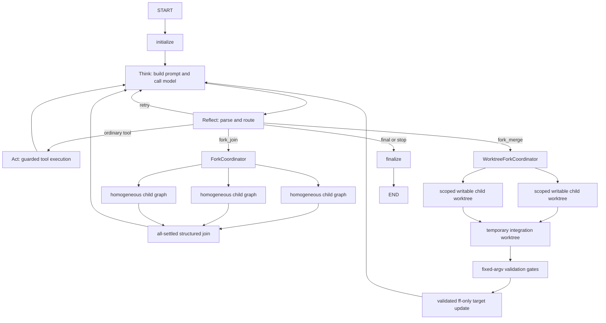
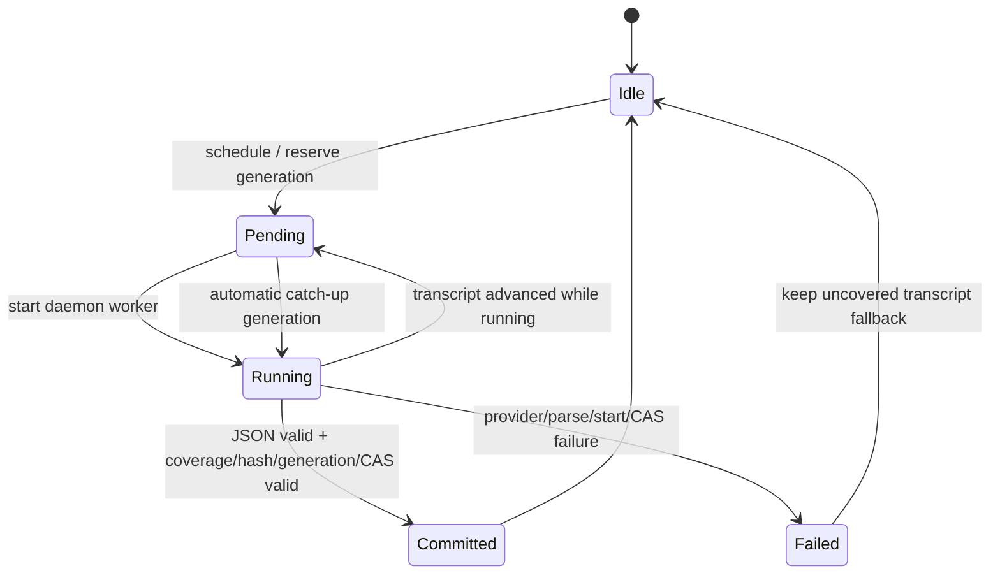
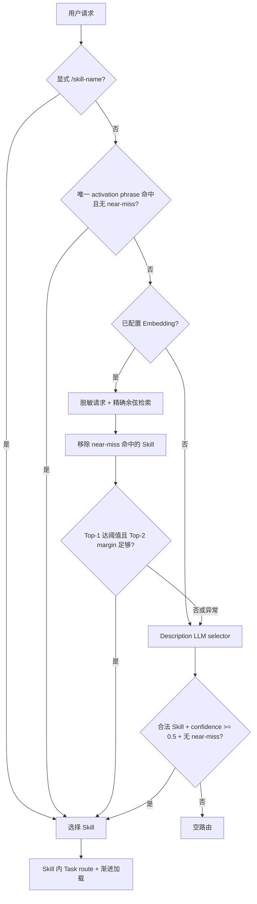

# 01 Agent 架构设计

## 1. 选型结论

CodeY 采用 **主 AgentLoop + 同质 Fork**，不采用 Supervisor-Worker。

主 Agent 与 Fork 子 Agent 都运行同一个 LangGraph `StateGraph` 模板，拥有相同的模型决策、Skill 路由、上下文管理、工具协议和停止逻辑。子 Agent 的差异只来自目标、上下文快照、预算、`thread_id` 和安全策略，不需要新增 Worker 类。

当前实现保留两条显式分离的同质 Fork 协议：

- `fork_join`：分支固定只读、`approval_policy="never"`、步数受限，主 Agent 对结构化证据做 `all_settled` 汇总。
- `fork_merge`：只有协调器预先配置固定参数验证命令时才暴露；父层把它视为高风险工具并审批，每个子 Agent 在独立 detached Git worktree 中只写自己的精确路径租约，协调器验证组合提交后才快进目标分支。

两条协议都复用同一个 AgentLoop/模型/工具控制合同；`fork_merge` 没有引入新的 Worker 类型，也没有把普通只读 Fork 悄悄放宽为可写。

## 2. 运行图



`Think / Reflect / Act` 是动态路由节点，而不是固定执行三次的流水线：

- `Think` 构造上下文、调用模型并绑定本次请求的 usage/cache metadata。
- `Reflect` 解析模型输出，通过 `add_conditional_edges` 路由到工具、Fork、重试或结束。
- `Act` 只通过 `ToolExecutor` 执行动作，保留参数校验、审批、工作区 diff 和审计边界。
- `Fork` 也是受控工具动作；它不能绕过 `ToolExecutor`。
- `finalize` 统一写最终 checkpoint、认知闭环、report 和最后一个 `run_finished` 事件。

实现入口为 `CodeY/core/agent_loop.py`。

## 3. 同质 Fork 协议

### 3.1 只读 `fork_join`

模型使用 `fork_join` 提交相互独立的目标：

```json
{
  "name": "fork_join",
  "args": {
    "tasks": [
      {"id": "api", "objective": "检查 API 调用链"},
      {"id": "tests", "objective": "检查测试覆盖"}
    ],
    "max_steps": 3,
    "join_policy": "all_settled"
  }
}
```

约束：

- 每次 2 到 `max_fork_branches` 个分支，默认最多 4 个。
- `max_parallel_branches` 控制并发槽位，默认 4。
- 分支 ID 在同一 Fork 内唯一，并规范化后用于工件路径。
- 每个分支创建独立 `CodeYAgent`、session、run、TaskState 和 graph thread。
- CLI 为每个分支创建独立 provider client；Python API 可传 `model_client_factory`。
- 没有 factory 时共享 parent client；若 Python factory 误把同一个 client 实例返回给多个分支，也会按对象身份共享同一把锁。两种情况都保持 `complete()` 与 metadata 快照绑定，但模型请求会串行；只有不同 client 实例才能形成 provider 调用重叠。
- Join 使用 `all_settled`：单个分支失败不会丢弃已完成结果。
- 返回父 Agent 的 Join JSON 被限制在 3600 字符内；长答案按分支裁剪，更完整的脱敏分支结果保存在独立工件中。

### 3.2 可写 `fork_merge`

`fork_merge` 只适用于能预先拆成互不重叠文件租约的修改任务：

```json
{
  "name": "fork_merge",
  "args": {
    "tasks": [
      {
        "id": "api",
        "objective": "更新 API 实现",
        "allowed_paths": ["src/api.py"]
      },
      {
        "id": "tests",
        "objective": "补充 API 测试",
        "allowed_paths": ["tests/test_api.py"]
      }
    ],
    "max_steps": 4,
    "merge_policy": "atomic_disjoint"
  }
}
```

启用条件与协议：

1. 启动时至少配置一条 `--fork-merge-check "..."`；这些命令由用户配置，转换为固定 argv 并以 `shell=False` 运行，模型不能修改命令。
2. `fork_merge` 标记为高风险工具，仍经过父 Agent 的 approval policy；没有验证命令时不进入工具表。
3. 目标必须是 clean 的本地 Git branch；detached HEAD、tracked/untracked dirty target、Git-ignored 租约、受保护元数据路径，以及本地 clean/smudge/process filter、external diff/textconv/custom merge driver 都 fail closed；`git status` 本身失败也按不安全处理。
4. 每个 branch 获得仓库外的独立 detached worktree、独立 child Agent/session/run/thread，以及精确的 repo-relative `allowed_paths`。Windows 大小写折叠后重复的租约会在启动前拒绝。
5. 可写 child 只暴露 `list_files/read_file/search/write_file/patch_file`；没有 `run_shell`、Git 命令或嵌套 Fork。文件工具在 symlink resolve 后再次校验精确写租约。
6. child 完成后，协调器核对真实 Git changed paths；环境中的已知 secret 在进入共享 Git object database 前扫描，随后才显式 stage，并继续执行 `git diff --check`、patch 大小、redaction 和候选提交父节点检查；任一 branch 失败则全部不合并。
7. 所有 candidate 按输入顺序进入一次性 integration worktree。验证前后都要求 `HEAD` 等于即将合并的 `integration_commit` 且 worktree/index clean；组合冲突、验证失败或目标 HEAD/ref/status 漂移时不执行目标快进。
8. 只有组合提交和全部验证通过后，协调器才在 repository lock 内对原分支执行 `git merge --ff-only`。这是一次本地快进，不会自动 push、开 PR 或解决冲突。

这是逻辑上的 `all-success` 路径：成功分支不会在另一分支失败时被部分应用。它不是跨进程崩溃原子事务；进程在最终快进与状态落盘之间终止时，必须根据已持久化的 `base_commit/target_ref/integration_commit` merge intent 人工核对。相同文件的并行编辑当前不自动做三方语义合并，而是在路径租约阶段拒绝；需要先重拆任务或人工集成。

## 4. 状态与隔离

`TaskState` schema v2 要求以下 Fork 字段完整存在；旧 task state 和旧 session schema 会被明确拒绝，不做隐式迁移或兼容：

| 字段 | 含义 |
| --- | --- |
| `graph_thread_id` | LangGraph checkpoint 隔离键 |
| `phase` | 当前 `think/reflect/act/fork/finalize` 阶段 |
| `parent_run_id` | 子运行对应的父 run |
| `fork_id` / `branch_id` | Fork 因果标识 |
| `fork_count` | 本 run 已完成的 Fork 数量 |
| `fork_summary` | 最近一次 Join 的无正文摘要 |

`thread_id` 只隔离 LangGraph checkpoint，不能隔离 Python 可变对象。因此：

- 同一个 `CodeYAgent` 的 `ask()` 被实例锁串行化。
- 同一实例不能复用显式 `thread_id`。
- 并行只能通过 ForkCoordinator 创建独立 child agent。
- provider 文本和 metadata 在锁内绑定成 `ModelCompletion`，避免 usage 串线。

可写 Fork 还增加 Git 隔离：`thread_id` 不承担文件隔离；文件隔离由独立 worktree + 精确路径租约实现，协议内只有协调器更新目标 ref。普通 Git/IDE 进程不遵守 CodeY repository lock，因此最终仍依赖 pre-merge 漂移检查、`ff-only` 和 post-merge 复核；它不是对外部进程的全局锁。worktree 仍共享 Git object database，因此它也不是 OS sandbox；子 Agent 不暴露 shell/Git，生产中的不可信仓库仍需要容器、受限用户和网络隔离。

## 5. Checkpointer

开发与测试默认使用 `InMemorySaver`。可通过 `graph_checkpointer=` 注入其他 LangGraph checkpointer。

Graph state 可能包含用户请求、模型输出和工具参数。为避免把这些内容意外写入额外存储，非内存 checkpointer 默认被拒绝；生产使用 SQLite/Redis 前必须：

1. 使用访问受限或加密的存储；
2. 明确评估数据保留和删除策略；
3. 传入 `allow_persistent_graph_checkpointer=True`；
4. 继续使用 CodeY 自有 session/checkpoint 作为跨进程恢复事实来源。

当前 `thread_id` 用于单次运行隔离，不承诺通过复用相同 ID 继续一次已结束运行。

## 6. 工件与事件

```text
.codey/
├─ sessions/<session-id>.json
└─ runs/<parent-run-id>/
   ├─ task_state.json
   ├─ trace.jsonl
   ├─ report.json
   └─ branches/<fork-id>/
      ├─ <branch-id>.json
      └─ <branch-id>.patch
```

Fork 生命周期事件：

- `fork_started`
- `branch_started`
- `branch_finished` / `branch_failed`
- `join_completed` / `join_failed`
- `merge_fork_started`
- `merge_branch_started`
- `merge_branch_candidate` / `merge_branch_failed`
- `integration_started`
- `merge_completed` / `merge_failed`

分支自身仍产生完整的独立 run 工件。父 trace 只保存 ID、状态、耗时和结果路径，不复制完整子输出。`run_finished` 继续是每个 run 的最后一个 CodeY trace 事件。

## 7. 安全和失败语义

- `fork_join` 子 Agent 固定只读，无法批准 `write_file`、`patch_file` 或 `run_shell`。
- `fork_merge` 子 Agent 只在独立 worktree 内自动批准 `write_file/patch_file`，并由精确路径租约与候选 diff 双重约束；它不能运行 shell 或 Git。
- Join 内容和 branch result 在进入父 session 前执行 secret redaction。
- Fork 基础设施异常会把 session 中的 fork 状态置为 `failed`，并发出 `join_failed`。
- Join 会等待所有分支进入终态。同步 provider 调用无法被 Python 安全地强制取消，因此当前不提供会留下后台任务的伪组级 timeout；生产必须为 provider HTTP 和工具分别配置有界 timeout。
- `fork_merge` 的目标更新采用 clean-base + HEAD/ref/status 再验证 + `ff-only`；不会 stash、reset、覆盖 dirty target、自动重试到新基线或自动解决冲突。目标更新前先持久化 merge intent，更新后立即记录 `target_updated`；当前尚无启动时自动 reconciliation，崩溃恢复仍需人工按 commit 三元组核对。
- validation command 是用户授权的本地进程，不是容器沙箱。协调器使用 `shell=False` 和过滤后的环境，并在每条命令后核对 integration `HEAD` 与 clean status；命令本身仍应选择可信、无网络副作用的测试入口。
- 协调器 Git 子进程清除继承的 `GIT_*` 覆盖，禁用 system/global config、hooks、credential helper、fsmonitor 和 external diff/textconv，并只重新注入经过值白名单校验的 `core.autocrlf/eol/safecrlf/ignorecase/symlinks/filemode`。
- Windows cleanup 遇到文件占用或 Git 超时时逐项报告 `cleanup_pending`，不会让清理异常覆盖已经完成的目标快进，也不会无范围执行 `git worktree prune`。

## 8. 异步会话摘要

摘要不阻塞主 AgentLoop 的最终回答。每个完整 turn 在 `finalize` 后只提交刷新意图，真正的 LLM 调用由 `AsyncConversationSummarizer` 的 daemon worker 完成：



关键不变量：

- 同一 session epoch 最多一个活动 worker；重复 schedule 合并，不产生同 coverage 的并发摘要。
- worker 运行期间 transcript 增长时只记录补跑意图，当前 worker 终止后再为最新 coverage 建新 generation。
- 提交必须同时满足 epoch、pending generation、coverage、source hash、transcript prefix 和 session revision CAS。
- 失败、pending 或旧摘要未覆盖的 transcript 保留原文进入 ContextManager，不把“正在算”误当成“已经记住”。
- resume 会把持久化但未完成的 pending 标为中断错误，并立即重排；CLI close 只做有界等待，不无限阻塞退出。

## 9. Skill 向量语义路由

Skill 粗路由采用“确定性高精度边界 + 向量召回判定 + LLM 兜底”，Task 细路由仍只在已选 Skill 内执行：



索引文本只包含 Skill 名称、正向 Description、activation phrase 和 Task label/trigger，不把 near-miss 当成相似语义样本。索引由 Embedding client 身份与文本内容生成 fingerprint，按批构建并在父 Agent 与同质 Fork 之间共享；当前规模使用进程内精确 cosine，避免引入向量数据库和持久化一致性负担。向量只有在 similarity 与 margin 同时过线时才直接激活，否则交给原有 Description LLM selector；显式 near-miss 在向量候选和最终 selector 结果上都是硬否决。

Embedding 后端为可注入协议，内置 OpenAI-compatible `/v1/embeddings` 与 Ollama `/api/embed` 适配器。默认关闭，启用后 Skill 正向描述和脱敏请求会发送给配置的服务；原始向量不持久化，report/prompt metadata 只保存可审计的模型、维数、fingerprint、分数、margin、状态和错误类型。

## 10. 代码映射

| 模块 | 职责 |
| --- | --- |
| `CodeY/core/agent_loop.py` | StateGraph 模板和动态条件路由 |
| `CodeY/core/fork.py` | ForkCoordinator、BranchSpec、BranchResult、Join |
| `CodeY/core/worktree_fork.py` | scoped writable Fork、detached worktree、候选提交、临时集成、验证和 `ff-only` |
| `CodeY/core/runtime.py` | Agent 隔离、provider factory、实例锁 |
| `CodeY/context/transcript.py` | 异步摘要调度、coverage/hash/generation/CAS 提交与失败回退 |
| `CodeY/skills/router.py` | 显式/词法/near-miss 边界与 Task 渐进路由 |
| `CodeY/skills/semantic.py` | Skill 语义文档、fingerprint cache、精确余弦与阈值/margin 判定 |
| `CodeY/providers/embeddings.py` | OpenAI-compatible 与 Ollama Embedding 协议适配 |
| `CodeY/tools/registry.py` | `fork_join` / `fork_merge` schema、精确路径租约校验和注册 |
| `CodeY/storage/run.py` | 分支结果与脱敏 patch 原子落盘 |
| `CodeY/core/task_state.py` | 图和 Fork 的可恢复摘要状态 |

系统提供同质的只读 `fork_join` 与隔离可写 `fork_merge`，不保留旧的同步单分支委派协议，也不创建新的 Worker 类型。前者适合宽读取和独立核验，后者只适合 clean Git 基线、互斥精确文件租约和可执行验证门都已明确的代码修改。
