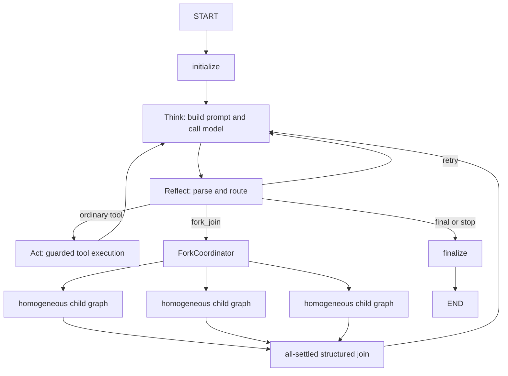

# 01 Agent 架构设计

## 1. 选型结论

CodeY 采用 **主 AgentLoop + 同质 Fork**，不采用 Supervisor-Worker。

主 Agent 与 Fork 子 Agent 都运行同一个 LangGraph `StateGraph` 模板，拥有相同的模型决策、Skill 路由、上下文管理、工具协议和停止逻辑。子 Agent 的差异只来自目标、上下文快照、预算、`thread_id` 和安全策略，不需要新增 Worker 类。

当前实现的 Fork 分支固定为只读、`approval_policy="never"`、步数受限且默认只允许一层。主 Agent 收集结构化分支结果后继续思考并生成最终答案。

## 2. 运行图



`Think / Reflect / Act` 是动态路由节点，而不是固定执行三次的流水线：

- `Think` 构造上下文、调用模型并绑定本次请求的 usage/cache metadata。
- `Reflect` 解析模型输出，通过 `add_conditional_edges` 路由到工具、Fork、重试或结束。
- `Act` 只通过 `ToolExecutor` 执行动作，保留参数校验、审批、工作区 diff 和审计边界。
- `Fork` 也是受控工具动作；它不能绕过 `ToolExecutor`。
- `finalize` 统一写最终 checkpoint、认知闭环、report 和最后一个 `run_finished` 事件。

实现入口为 `CodeY/core/agent_loop.py`。

## 3. 同质 Fork 协议

模型使用 `fork_join` 提交相互独立的目标：

```json
{
  "name": "fork_join",
  "args": {
    "tasks": [
      {"id": "api", "objective": "检查 API 调用链"},
      {"id": "tests", "objective": "检查测试覆盖"}
    ],
    "max_steps": 3,
    "join_policy": "all_settled"
  }
}
```

约束：

- 每次 2 到 `max_fork_branches` 个分支，默认最多 4 个。
- `max_parallel_branches` 控制并发槽位，默认 4。
- 分支 ID 在同一 Fork 内唯一，并规范化后用于工件路径。
- 每个分支创建独立 `CodeYAgent`、session、run、TaskState 和 graph thread。
- CLI 为每个分支创建独立 provider client；Python API 可传 `model_client_factory`。
- 没有 factory 时共享 client，但 `complete()` 与 metadata 快照被同一锁保护，因此正确但模型请求会串行。
- Join 使用 `all_settled`：单个分支失败不会丢弃已完成结果。
- 返回父 Agent 的 Join JSON 被限制在 3600 字符内；长答案按分支裁剪，更完整的脱敏分支结果保存在独立工件中。

## 4. 状态与隔离

`TaskState` schema v2 要求以下 Fork 字段完整存在；旧 task state 和旧 session schema 会被明确拒绝，不做隐式迁移或兼容：

| 字段 | 含义 |
| --- | --- |
| `graph_thread_id` | LangGraph checkpoint 隔离键 |
| `phase` | 当前 `think/reflect/act/fork/finalize` 阶段 |
| `parent_run_id` | 子运行对应的父 run |
| `fork_id` / `branch_id` | Fork 因果标识 |
| `fork_count` | 本 run 已完成的 Fork 数量 |
| `fork_summary` | 最近一次 Join 的无正文摘要 |

`thread_id` 只隔离 LangGraph checkpoint，不能隔离 Python 可变对象。因此：

- 同一个 `CodeYAgent` 的 `ask()` 被实例锁串行化。
- 同一实例不能复用显式 `thread_id`。
- 并行只能通过 ForkCoordinator 创建独立 child agent。
- provider 文本和 metadata 在锁内绑定成 `ModelCompletion`，避免 usage 串线。

## 5. Checkpointer

开发与测试默认使用 `InMemorySaver`。可通过 `graph_checkpointer=` 注入其他 LangGraph checkpointer。

Graph state 可能包含用户请求、模型输出和工具参数。为避免把这些内容意外写入额外存储，非内存 checkpointer 默认被拒绝；生产使用 SQLite/Redis 前必须：

1. 使用访问受限或加密的存储；
2. 明确评估数据保留和删除策略；
3. 传入 `allow_persistent_graph_checkpointer=True`；
4. 继续使用 CodeY 自有 session/checkpoint 作为跨进程恢复事实来源。

当前 `thread_id` 用于单次运行隔离，不承诺通过复用相同 ID 继续一次已结束运行。

## 6. 工件与事件

```text
.codey/
├─ sessions/<session-id>.json
└─ runs/<parent-run-id>/
   ├─ task_state.json
   ├─ trace.jsonl
   ├─ report.json
   └─ branches/<fork-id>/<branch-id>.json
```

Fork 生命周期事件：

- `fork_started`
- `branch_started`
- `branch_finished` / `branch_failed`
- `join_completed` / `join_failed`

分支自身仍产生完整的独立 run 工件。父 trace 只保存 ID、状态、耗时和结果路径，不复制完整子输出。`run_finished` 继续是每个 run 的最后一个 CodeY trace 事件。

## 7. 安全和失败语义

- 子 Agent 固定只读，无法批准 `write_file`、`patch_file` 或 `run_shell`。
- Join 内容和 branch result 在进入父 session 前执行 secret redaction。
- Fork 基础设施异常会把 session 中的 fork 状态置为 `failed`，并发出 `join_failed`。
- Join 会等待所有分支进入终态。同步 provider 调用无法被 Python 安全地强制取消，因此当前不提供会留下后台任务的伪组级 timeout；生产必须为 provider HTTP 和工具分别配置有界 timeout。
- 多个可写 Agent 不属于当前架构。若未来开放，必须使用独立 worktree 或资源租约与显式合并协议。

## 8. 代码映射

| 模块 | 职责 |
| --- | --- |
| `CodeY/core/agent_loop.py` | StateGraph 模板和动态条件路由 |
| `CodeY/core/fork.py` | ForkCoordinator、BranchSpec、BranchResult、Join |
| `CodeY/core/runtime.py` | Agent 隔离、provider factory、实例锁 |
| `CodeY/tools/registry.py` | `fork_join` schema、校验和注册 |
| `CodeY/storage/run.py` | 分支结果原子落盘 |
| `CodeY/core/task_state.py` | 图和 Fork 的可恢复摘要状态 |

系统只提供同质 `fork_join` 分支接口，不保留旧的同步单分支委派协议，也不创建新的 Worker 类型。
